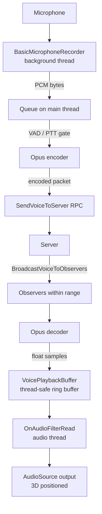

```markdown
# OpenVoiceSharp for Unity & FishNet – 3D Voice Chat

A Unity component that adds **real-time positional voice chat** to multiplayer games using [FishNet](https://fish-networking.gitbook.io/) and [OpenVoiceSharp](https://github.com/JamesHepp/OpenVoiceSharp) (Opus codec).  
Voice is transmitted only to nearby players thanks to FishNet's `NetworkObserver` distance‑based culling, while Unity's `AudioSource` handles 3D panning and rolloff.


---

## Features

- ✅ **3D positional audio** – uses Unity's `AudioSource` distance rolloff (linear, log, custom).
- ✅ **Efficient Opus encoding/decoding** – via OpenVoiceSharp (low bandwidth, high quality).
- ✅ **Push‑to‑Talk or Voice Activity Detection (VAD)** – choose the input method that fits your game.
- ✅ **Network‑aware** – built on FishNet `NetworkBehaviour`. Works with `NetworkObserver` for automatic distance‑based observers.
- ✅ **Thread‑safe** – microphone capture runs on a background thread; RPCs are queued to the main thread.
- ✅ **Low latency** – unreliable channels, minimal buffering.

---

## Requirements

- **Unity 2021.3 or newer** (tested with 2022 LTS)
- **FishNet** – install via the Unity Asset Store or Git URL.
- **OpenVoiceSharp** – custom Unity package that includes:
  - `BasicMicrophoneRecorder` (NAudio based)
  - `VoiceChatInterface` (Opus wrapper)
  - `VoiceUtilities`
- **Project Audio Settings**: System Sample Rate = **48000 Hz**  
  *(Edit > Project Settings > Audio > System Sample Rate)*

> ⚠️ **Important** – OpenVoiceSharp expects 48 kHz audio. The component will warn you if Unity’s output sample rate is different.

---

## Installation

1. **Import dependencies**  
   - Add FishNet to your project.  
   - Add OpenVoiceSharp (the .dll or source) – make sure `BasicMicrophoneRecorder`, `VoiceChatInterface` and `VoiceUtilities` are accessible.

2. **Add the script**  
   - Place `PlayerVoice.cs` inside your `Scripts` folder.

3. **Set up your player prefab**  
   - Add a `NetworkObject` component.  
   - Add a `NetworkObserver` component – configure its `DistanceCondition` to set the voice chat range (e.g. 30 units).  
   - Add an `AudioSource` – the script will automatically set it to 3D, linear rolloff, and loop a silent clip.  
   - Add the `PlayerVoice` component.

4. **Configure the component**  
   - Adjust `Min Distance` / `Max Distance` – these control the audio rolloff curve (not the network observer range).  
   - Choose `Push To Talk` or VAD, and set the key if needed.

5. **Build & run** – the owner will start capturing microphone input; remote players will hear only those within their observer range.

---

## How It Works



- **Capture** – `BasicMicrophoneRecorder` pushes 16‑bit PCM on a background thread.  
- **Queue** – data is queued to the main thread to avoid RPC threading issues.  
- **Encode** – `VoiceChatInterface` encodes the PCM to Opus (only if VAD detects speech or PTT is held).  
- **Network** – the client sends the packet to the server, which forwards it to all observers **except the speaker**.  
- **Playback** – the remote client decodes Opus to float samples, writes them into a thread‑safe ring buffer, and `OnAudioFilterRead` mixes them into the AudioSource’s output.  
- **3D Audio** – because the `AudioSource` is set to `spatialBlend = 1`, Unity’s audio engine automatically applies distance attenuation and panning.

---

## Configuration Tips

### Observer Range (FishNet)
The voice chat “range” is controlled by the `DistanceCondition` on your `NetworkObserver`.  
- The `PlayerVoice` component’s `minDistance` / `maxDistance` control the **audio rolloff curve** (how volume decreases with distance).  
- For best results, set the observer range slightly larger than `maxDistance` so that players just beyond hearing distance are not even sent voice data.

### Performance
- The ring buffer is fixed‑size (1 second of 48 kHz mono = 48,000 samples). If the network lags, older packets are dropped silently – no memory leak.
- Opus encoding/decoding is very fast; use the default bitrate (OpenVoiceSharp’s default is 16–32 kbps per stream).

### Troubleshooting

| Issue | Likely cause | Solution |
|-------|--------------|----------|
| No voice heard | AudioSource not playing | Ensure the AudioSource is on the same GameObject and `loop` is enabled. The script creates a silent clip and calls `Play()`. |
| Voice is choppy / stuttering | Network loss or high latency | The component drops packets when the buffer is full – increase ring buffer size in `VoicePlaybackBuffer` constructor. |
| Microphone not working | No recording device or wrong sample rate | Check `BasicMicrophoneRecorder` – it defaults to 48 kHz. Also verify Unity’s microphone permissions. |
| Warning about 48 kHz | Unity output sample rate mismatch | Change Project Settings > Audio > System Sample Rate to 48000. |
| No voice in builds | Microphone permissions not requested | Request microphone permission manually before starting the recorder. |

---

## Customisation

### Switching to VAD
Set `pushToTalk = false` in the inspector. The encoder’s `IsSpeaking()` method will automatically gate transmission.

### Adjusting Voice Activity Detection
OpenVoiceSharp’s `VoiceChatInterface` has its own VAD sensitivity – you can modify the constructor parameters or expose them in `PlayerVoice`.

### Using a different audio source rolloff
The script sets `rolloffMode = Linear` by default. Change it in `SetupPlayback()` to `Logarithmic` or `Custom` if you prefer.

---

## Dependencies & Credits

- **FishNet** – [https://fish-networking.gitbook.io/](https://fish-networking.gitbook.io/)  
- **OpenVoiceSharp** – [https://github.com/JamesHepp/OpenVoiceSharp](https://github.com/JamesHepp/OpenVoiceSharp) (Opus for Unity)  
- **NAudio** – used by OpenVoiceSharp for microphone capture

---

## License

This script is provided under the MIT License. You are free to use, modify, and distribute it as part of your commercial or non‑commercial Unity projects.

---

## Contributing

Pull requests and issues are welcome! Please ensure your changes respect the thread‑safe design (background capture, main‑thread RPCs, audio‑thread playback).

---

**Happy voice chatting! 🎙️**  
If you find this useful, star the repo and share your game’s voice feature.
```
